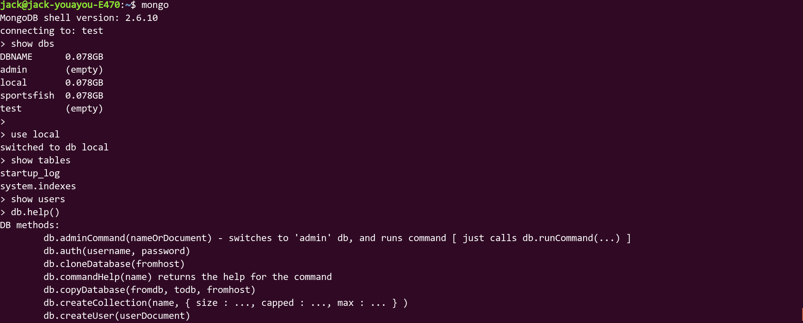
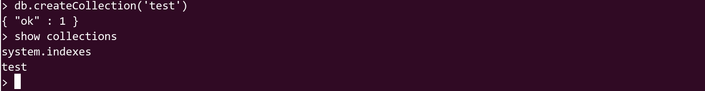

<!--
author: Jack.Spanrrows
date: 2018-02-12 
title: Ubuntu下MongoDB的安装和使用
tags: MongoDB
category: MongoDB
status: publish
summary: Ubuntu下MongoDB的安装和使用
-->
##### MongoDB简介
######MongoDB 是一个是一个基于分布式文件存储的数据库，介于关系数据库和非关系数据库之间，是非关系数据库当中功能最丰富，最像关系数据库的。他支持的数据结构非常松散，是类似json的bson格式，因此可以存储比较复杂的数据类型。Mongo最大的特点是他支持的查询语言非常强大，其语法有点类似于面向对象的查询语言，几乎可以实现类似关系数据库单表查询的绝大部分功能，而且还支持对数据建立索引。


##### 安装MongoDB
######MongoDB安装很简单，无需下载源文件，可以直接用apt-get命令进行安装。 
######打开终端，输入以下命令：
```
sudo apt-get install mongodb

```

######安装完成后，在终端输入以下命令查看MongoDB版本：
```


mongo -version
```
######输出版本信息，表明安装成功，截图如下：

#####启动和关闭mongodb命令如下：
######方法一：
```
service mongodb start
service mongodb stop
```

######我自己安装版本是这样启动的：
```
cd /opt/ && nohup mongod --dbpath . &
```
######这样就挂到后台了
```
然后在执行命令 mongo 就可以进入数据库了
```

###### 卸载mongodb
```
sudo apt-get --purge remove mongodb mongodb-clients mongodb-server
```


>shell命令模式


>输入mongo进入shell命令模式，默认连接的数据库是test数据库，在此之前一定要确保你已经启动了MongoDB，
否则会出现错误，启动之后运行成功，如下截图：


>常用操作命令：
数据库相关<br/> 
show dbs:显示数据库列表 <br/>
show collections：显示当前数据库中的集合（类似关系数据库中的表table） <br/>
show users：显示所有用户 <br/>
use yourDB：切换当前数据库至yourDB <br/>
db.help() ：显示数据库操作命令 <br/>
db.yourCollection.help() ：显示集合操作命令，yourCollection是集合名 <br/>

######截图如下：



######如何删除数据库呢？我们手动删除已存在数据库DBNAME，上图：


######现在我们重新建库，库名为DBNAME


######接下来我们来创建集合就是所谓的表


######到这里我们熟悉了MongoDB在ubuntu下的安装方式以及基本的启动命令，创建库，删除库，建集合以及其他几个基础命令，是不是很简单呢？你学会了吗？